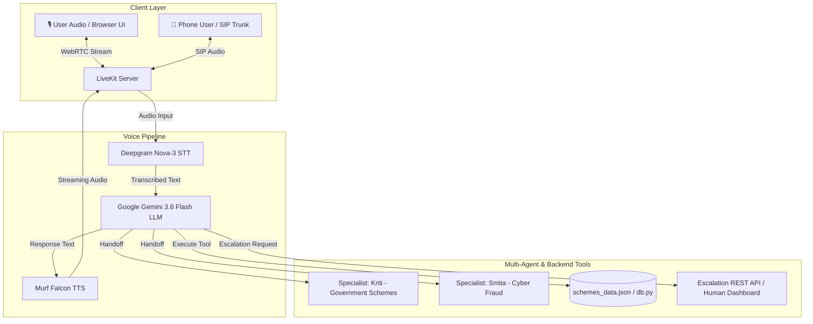

# Cyber Suraksha Kendra & Financial Schemes Voice AI Agent

A production-grade, real-time Voice AI system for digital safety awareness, government financial scheme eligibility, human escalation, and cyber fraud incident reporting — powered by **Murf Falcon TTS**, **Google Gemini 3.6 Flash**, **Deepgram Nova-3 STT**, and **LiveKit Agents**.

[](https://opensource.org/licenses/MIT) [](https://murf.ai/api/docs/text-to-speech/streaming) [](https://deepmind.google/technologies/gemini/) [](https://docs.livekit.io) [](https://www.typescriptlang.org/) [](https://www.python.org/)

---

## AI Models & Stack Specifications

| Component | Model / Provider | Configuration / Voice ID | Purpose |
| :--- | :--- | :--- | :--- |
| **LLM (Brain)** | **Google Gemini 3.6 Flash** | `gemini-3.6-flash` | Reasoning, caller turn management, tool routing & multi-agent handoffs |
| **TTS (Voice)** | **Murf Falcon** | Primary: `Anisha` (Hindi/Hinglish Female)<br>Scheme Specialist: `Kriti`<br>Fraud Specialist: `Smita` / `Pooja` | High-speed, streaming text-to-speech with natural conversational prosody |
| **STT (Ears)** | **Deepgram Nova-3** | `model="nova-3"`, `language="multi"` | Real-time speech recognition tuned for Indian English & Hindi |
| **Turn Detection**| **LiveKit Multilingual VAD** | `MultilingualModel` + `BVCTelephony` / `BVC` | Voice activity detection & barge-in interruption handling |
| **Real-time Transport**| **LiveKit Cloud / Local Server**| WebSockets & WebRTC | Ultra-low latency bidrectional audio streaming |

---

## Agent & Specialist Personas

1. **Primary Agent: Anjali Arora (अंजलि अरोड़ा)**
   - **Role**: Digital Safety Expert & Financial Literacy Advisor at *Cyber Suraksha Kendra*.
   - **Voice**: Murf Falcon (`Anisha`, female voice).
   - **Responsibilities**: Welcomes callers, handles digital payment safety queries, looks up returning callers in SQLite database (`db.py`), asks consent before saving user memory, and routes requests to specialist agents.

2. **Government Scheme Specialist: Kriti (कृति)**
   - **Role**: Government Financial Schemes & Eligibility Specialist.
   - **Voice**: Murf Falcon (`Kriti`, female voice).
   - **Responsibilities**: Evaluates eligibility and required document checklists for Indian government schemes: **PM-KISAN**, **PM MUDRA Yojana**, **Atal Pension Yojana**, **Sukanya Samriddhi Yojana**, and **Ayushman Bharat**.

3. **Cyber Fraud Emergency Specialist: Smita (स्मिता)**
   - **Role**: Cyber Crime & Incident Response Specialist.
   - **Voice**: Murf Falcon (`Smita`, female voice).
   - **Responsibilities**: Guides victims of financial fraud, logs incident reports without sensitive credentials (PINs/OTPs), and provides immediate emergency escalation guidance for the National Cyber Crime Helpline (**1930**).

---

## Architecture Overview



---

## Key Features

- **Financial Scheme Eligibility Lookup (`schemes.py`)**: Real-time evaluation of eligibility criteria and document requirements for top 5 Indian financial schemes.
- **Out-Loud Tool Failure Recovery**: When datasets or servers fail, tools return a structured `spoken_failure_message` so the agent speaks a natural status update instead of hallucinating or crashing.
- **Caller Memory & Database (`db.py`)**: Persists caller history in SQLite with explicit consent safeguards (never stores sensitive keys like PINs, Passwords, or OTPs).
- **Outbound SIP Deadline Alerts (`outbound_call.py`)**: Initiates automated outbound calls to remind users of scheme application deadlines.
- **Human Escalation (`escalation_api.py`)**: REST endpoints to log, view, and assign human supervisor intervention requests.
- **Call Analytics Dashboard**: Frontend and backend integration tracking turn latencies, completion outcomes, and channel stats.

---

## How to Run the Project (Step-by-Step)

### Prerequisites

- **Python** 3.10+ with **[uv](https://docs.astral.sh/uv/)** installed
- **Node.js** 18+ with **pnpm** installed (`npm install -g pnpm`)
- **LiveKit Server** CLI (`livekit-server --dev`)

---

### Step 1: Environment Setup

Create `.env.local` in both `backend/` and `frontend/` folders:

```env
# LiveKit Credentials
LIVEKIT_URL=wss://your-livekit-domain.livekit.cloud
LIVEKIT_API_KEY=your_livekit_api_key
LIVEKIT_API_SECRET=your_livekit_api_secret

# AI Models API Keys
GOOGLE_API_KEY=your_gemini_api_key
MURF_API_KEY=your_murf_api_key
DEEPGRAM_API_KEY=your_deepgram_api_key
```

---

### Step 2: Start the Services

Run each component in a separate terminal:

#### Terminal 1 — LiveKit Server
```bash
livekit-server --dev
```

#### Terminal 2 — Escalation & Call Analytics REST API
```bash
cd backend
uv run python src/escalation_api.py
```
*(Runs REST server on `http://localhost:5000`)*

#### Terminal 3 — Backend Voice Agent Workers (Anjali + Specialists)
```bash
cd backend
uv sync
uv run python src/agent.py dev
```

#### Terminal 4 — Next.js Frontend & Analytics Dashboard
```bash
cd frontend
pnpm install
pnpm dev
```
*(Open **http://localhost:3000** in your browser)*

#### Terminal 5 (Optional) — Trigger Outbound Phone Call
```bash
cd backend
uv run python src/outbound_call.py
```

---

## Project Structure

```
murf-livekit-starter/
├── backend/                         # Python Agent Service
│   ├── src/
│   │   ├── agent.py                 # Primary entrypoint (Anjali Arora), Gemini 3.6 Flash & Murf Falcon setup
│   │   ├── Prompt.py                # System prompts for Anjali, Kriti, and Smita
│   │   ├── specialist_agent.py      # Government Schemes (Kriti) & Cyber Fraud (Smita) Specialist agents
│   │   ├── schemes.py               # Scheme evaluation and document checklist tool logic
│   │   ├── schemes_data.json        # Scheme criteria dataset
│   │   ├── db.py                    # SQLite caller database & call analytics logging
│   │   ├── escalation.py            # Human escalation logic
│   │   ├── escalation_api.py        # Flask/FastAPI REST API for human support UI
│   │   └── outbound_call.py         # Outbound SIP call dispatch script
│   └── pyproject.toml               # Python dependencies managed by uv
├── frontend/                        # Next.js 14 Web Application
│   ├── app/                         # App router, pages, and API endpoints
│   ├── components/                  # LiveKit room components & call analytics dashboard UI
│   └── package.json                 # Node dependencies (pnpm)
├── start_app.ps1                    # PowerShell convenience launch script (Windows)
├── start_app.sh                     # Bash convenience launch script (macOS/Linux)
└── README.md                        # Documentation
```

---

## License

MIT License

